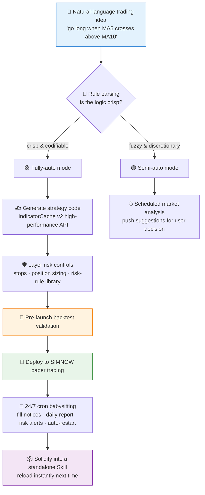

# 🤖 SSQuant AI Trader (ssquant-ai-trader)

[简体中文](README.md) | **English**

> You talk; the AI writes the code, runs the strategy, watches the market, and manages the risk.

<p align="center">
  
  
  
  
  
  
</p>

---

## 📖 Introduction

**`ssquant-ai-trader`** is an **intelligent trade-execution engine** built on the SSQuant framework.

Users describe trading logic in plain natural language — whether crisply codifiable rules or fuzzy discretionary instincts — and the AI generates high-performance strategy code, deploys it to the SIMNOW paper-trading environment, and provides round-the-clock monitoring, notifications, and risk protection.

## ⚡ Workflow



## ✨ Key Features

1.  **Dual-mode operation**:
    *   **Fully-auto mode**: crisp rules (e.g. MA golden cross) → AI-generated code runs fully automatically.
    *   **Semi-auto mode**: fuzzy rules (e.g. "fade the spike") → AI analyzes the market on a schedule and pushes suggestions for the user to decide.
2.  **Zero-config experience**:
    *   The AI detects the environment and guides or performs the SSQuant installation if missing.
    *   The AI reads the user's account credentials and writes `trading_config.py`; users never edit code files.
3.  **High-performance code generation**:
    *   Uses SSQuant's `IndicatorCache v2` high-performance API by default for efficient strategy execution.
4.  **Round-the-clock babysitting**:
    *   **Cron monitoring**: real-time fill notifications, daily reports, risk alerts.
    *   **Self-healing**: auto-restart and user notification on process crash or disconnect.
    *   **Pre-launch validation**: a backtest runs before any paper-trading deployment to confirm the strategy logic.
5.  **Skill solidification**:
    *   After a successful deployment, a standalone Skill file is created automatically for instant reuse next time.

## ⚙️ Requirements

| Dependency | Version | Notes |
|---|---|---|
| **SSQuant** | `>= 0.4.6` | Required; depends on the latest API and cache mechanism |
| **Python** | `3.9+` | — |

## 📂 Directory Layout

```text
ssquant-ai-trader/
├── SKILL.md          # Core instruction file (read by the Agent)
└── references/       # Knowledge base & templates
    ├── common-patterns.md        # Common strategy templates (dual MA, breakout, …)
    ├── notification-templates.md # Notification copy templates
    ├── risk-limits.md            # Risk-rule library
    ├── rule-parser.md            # Rule-parsing guide
    └── simnow-setup.md           # SIMNOW setup guide
```

## 🚀 Usage Example

**User**: "Trade rebar for me: go long when the 5-day MA crosses above the 10-day MA, close on a break below, 2 lots per trade, with a stop loss."

**AI (with this Skill loaded)**:

1.  Classifies the request as **fully-auto mode**.
2.  Generates `rb_ma_cross.py` (IndicatorCache edition).
3.  Layers on risk-control code (ATR stop loss).
4.  Runs a short backtest for validation.
5.  Launches the SIMNOW strategy.
6.  Creates the cron task and reports back to the user.

## 🤝 Relationship with `ssquant-trader-generator`

| Role | Responsibility |
|---|---|
| 🏭 [`ssquant-trader-generator`](https://github.com/quantskills/skill-ssquant-trader-generator) (factory) | High-level intent understanding, task orchestration, persistent Skill generation |
| ⚙️ **`ssquant-ai-trader`** (engine, this repo) | Low-level code generation, data fetching, trade execution, monitoring & notifications |

## ⚠️ Disclaimer

This skill deploys to the SIMNOW **paper-trading** environment only. Nothing here constitutes live-trading investment advice.

## 📄 License

This project is licensed under the GNU General Public License v3.0. See [LICENSE](LICENSE).
