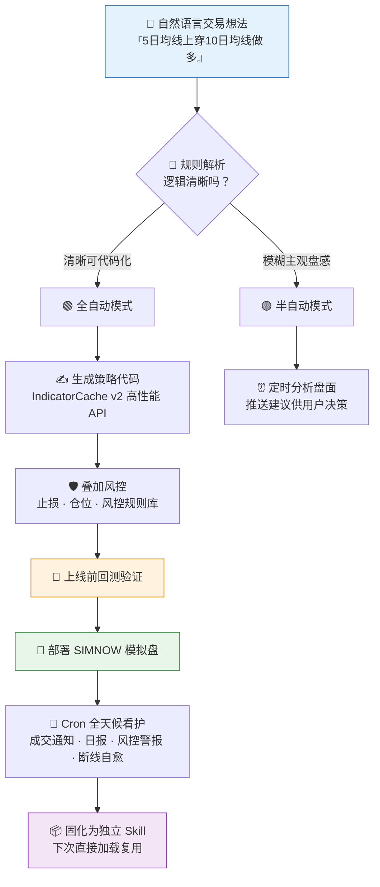

# 🤖 SSQuant AI Trader (ssquant-ai-trader)

**简体中文** | [English](README.en.md)

> 你负责说话，AI 负责写代码、跑策略、盯盘、控风险。

<p align="center">
  
  
  
  
  
  
</p>

---

## 📖 简介

**`ssquant-ai-trader`** 是一个基于 SSQuant 框架的**智能交易执行引擎**。

它允许用户仅用自然语言描述交易逻辑（无论清晰可代码化，还是模糊主观盘感），AI 即可自动生成高性能策略代码，部署到 SIMNOW 模拟盘，并提供全天候的监控、推送和风控保护。

## ⚡ 工作流



## ✨ 核心特性

1.  **双模式驱动**：
    *   **全自动模式**: 规则清晰（如均线金叉），AI 生成代码全自动执行。
    *   **半自动模式**: 规则模糊（如冲高回落），AI 定时分析盘面，推送建议供用户决策。
2.  **零配置体验 (Zero-Config)**：
    *   AI 自动检测环境，若未安装 SSQuant 则自动引导或执行安装。
    *   AI 自动读取用户输入的账号密码并写入 `trading_config.py`，无需用户修改代码文件。
3.  **高性能代码生成**：
    *   默认使用 SSQuant 的 `IndicatorCache v2` 高性能 API，确保策略运行效率。
4.  **全天候看护**：
    *   **Cron 监控**: 实时推送成交通知、日报、风控警报。
    *   **异常自愈**: 进程崩溃或断线时自动重启并通知用户。
    *   **上线前验证**: 部署模拟盘前自动跑回测，确认策略逻辑无误。
5.  **Skill 固化**:
    *   部署成功后自动创建独立的 Skill 文件，方便下次直接加载复用。

## ⚙️ 环境要求

| 依赖 | 版本 | 说明 |
|---|---|---|
| **SSQuant** | `>= 0.4.6` | 强制，依赖最新 API 与缓存机制 |
| **Python** | `3.9+` | — |

## 📂 目录结构

```text
ssquant-ai-trader/
├── SKILL.md          # 核心指令文件 (Agent 读取)
└── references/       # 知识库与模板
    ├── common-patterns.md        # 常见策略模板 (双均线、突破等)
    ├── notification-templates.md # 通知文案模板
    ├── risk-limits.md            # 风控规则库
    ├── rule-parser.md            # 规则解析指南
    └── simnow-setup.md           # SIMNOW 配置指南
```

## 🚀 使用示例

**用户**: "帮我做螺纹钢，5 日均线上穿 10 日均线就做多，跌破平仓，每次 2 手，设个止损。"

**AI (加载此 Skill 后)**:

1.  判断为**全自动模式**。
2.  生成 `rb_ma_cross.py` (IndicatorCache 版)。
3.  叠加风控代码 (ATR 止损)。
4.  运行短期回测验证。
5.  启动 SIMNOW 策略。
6.  创建 Cron 任务并告知用户。

## 🤝 与 `ssquant-trader-generator` 的关系

| 角色 | 职责 |
|---|---|
| 🏭 [`ssquant-trader-generator`](https://github.com/quantskills/skill-ssquant-trader-generator)（工厂） | 上层意图理解、任务编排、持久化 Skill 生成 |
| ⚙️ **`ssquant-ai-trader`**（引擎，本仓库） | 底层代码生成、数据拉取、交易执行、监控推送 |

## ⚠️ 免责声明

本技能仅部署 SIMNOW **模拟盘**，输出不构成任何实盘投资建议。

## 📄 许可证

本项目使用 GNU General Public License v3.0，详见 [LICENSE](LICENSE)。
